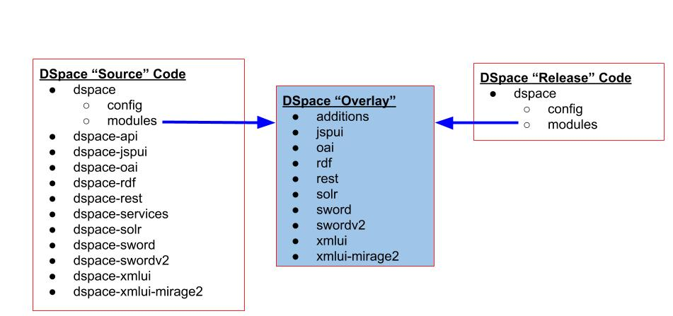
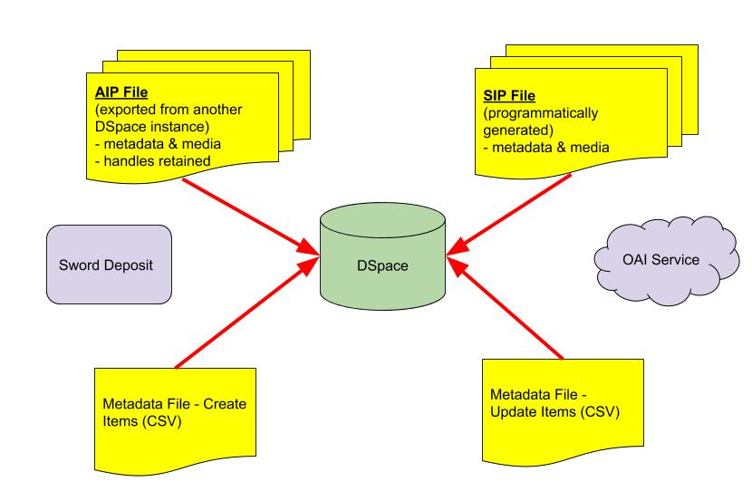
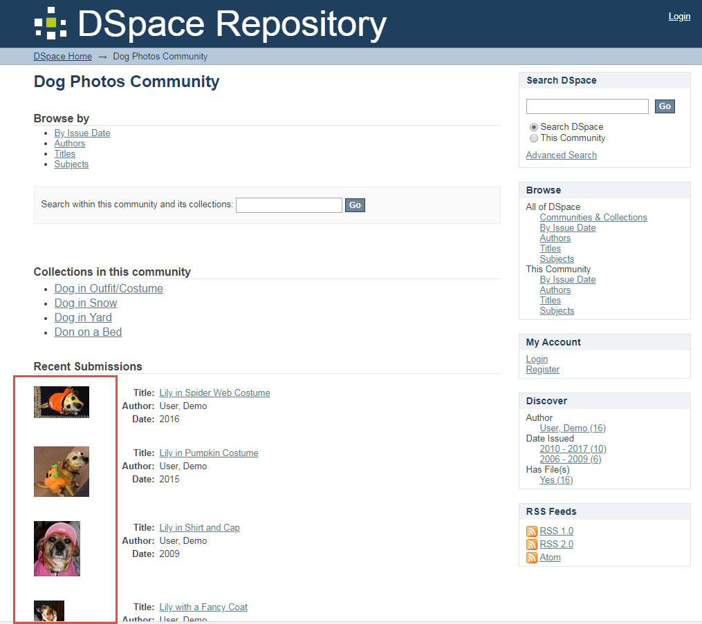
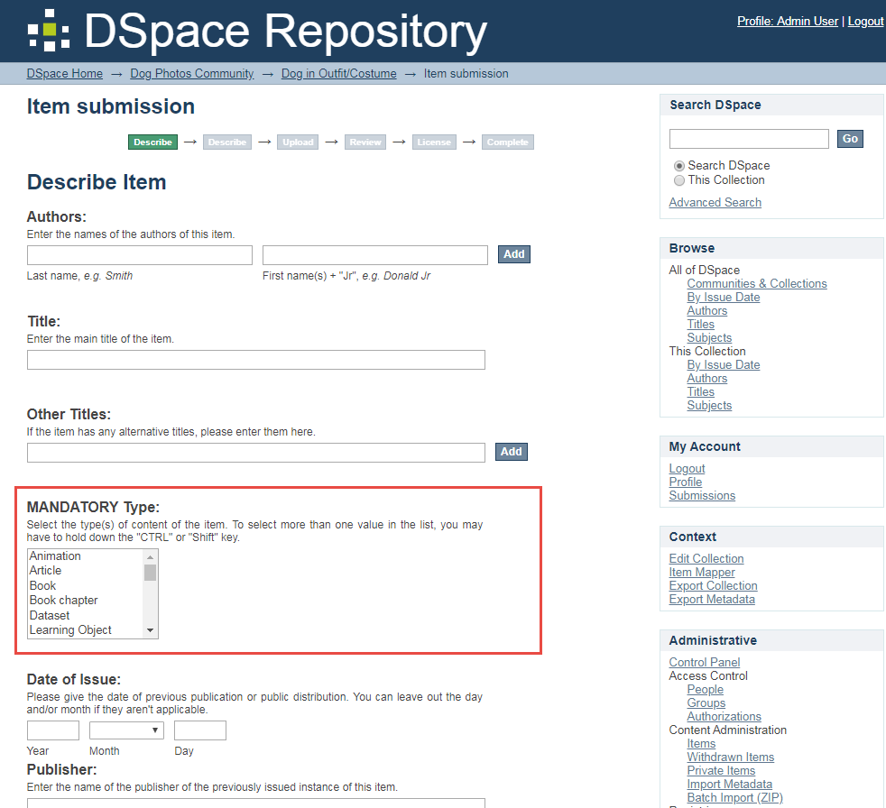
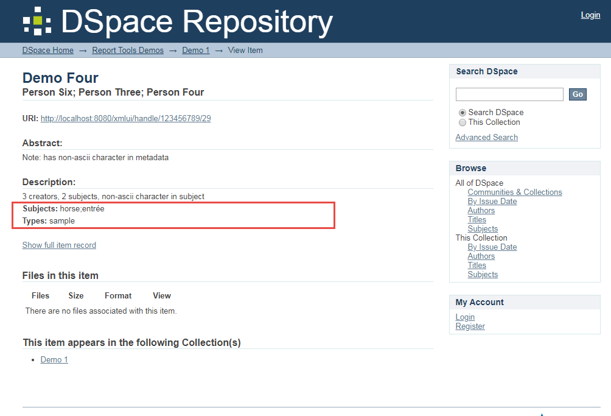
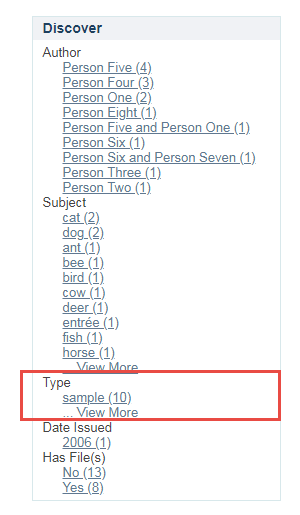
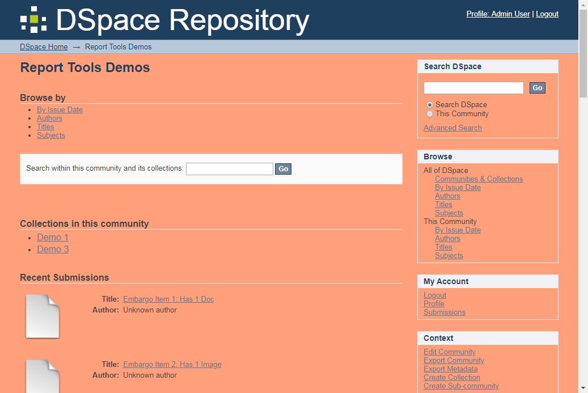

## Making DSpace Your Own

Terry Brady

Georgetown University Library

https://github.com/terrywbrady/info

---

### About Me

- DSpace Committer
- Software Developer for the Georgetown University Library
  - Lead developer for [DigitalGeorgetown](https://repository.library.georgetown.edu)

  

---

### Presentation Tasks

@ul 

- Demonstrate multiple ways to ingest content into DSpace
- Code 1: Change browse display properties
- Code 2: Change Collection Metadata
  - === 2a: Customize item submission process
  - === 2b: Customize item metadata to display
  - === 2c: Customize metadata navigation facets
- Code 3: Create a collection-specific theme

@ulend

+++

### About the presentation

- Not all of the code changes will make immediate sense
- The key is to see HOW the changes are made
- Once you know HOW to change something in DSpace, other types of changes are easy to learn
- As we rebuild DSpace, I will share some DigitalGeorgetown examples

---

### DSpace Code Overview

+++

### DSpace Code
- [DSpace 6x "Source" Code Branch](https://github.com/DSpace/DSpace/tree/dspace-6_x)
- [DSpace 6.2 Release Packages](https://github.com/DSpace/DSpace/releases/tag/dspace-6.2)

+++

### DSpace Code
- [DSpace 6.2 "Release" Code - For This Demo](https://github.com/DSpace-Labs/DSpace-rel-demo)
  - This is what we will modify

---

### Running DSpace

@ul

- You need a runtime environment for your code 
- A server with tomcat and a postgres database (linux preferred) 
- Docker or Vagrant containers (development tools) 
- Cloud development environment like Codenvy (codenvy.com) 
- For this presentation, Codenvy will be used 

@ulend

+++

### After the webinar, try it yourself!
- [This page](https://github.com/DSpace-Labs/DSpace-codenvy/blob/master/README.md) describes how you can configure a site on Codenvy
- [Codenvy Factory for this demo](https://codenvy.io/dashboard/#/load-factory/factoryk1vrec8gxat0diz6)

---

### Understanding Ingest Options
- Becoming comfortable with the ingest options for DSpace is a key way to make DSpace your own
- We will review a couple of options

+++ 

### Ingest into DSpace

---

### Ingest 1: Import Image Collection AIP Files 
- _For time, this has already been run_
- AIP Ingests preserve handle ids
- [Sample AIP Files with pictures of my dog](https://github.com/DSpace-Labs/DSpace-codenvy/tree/master/TestData)

+++?code=https://raw.githubusercontent.com/DSpace-Labs/DSpace-codenvy/master/Scripts/workspaceInit.sh
Workspace initialization script - already run
@[34](Before ingesting content, we need an administrator id)
@[36-43](Data Load Script)

+++

### Open Site and Navigate to Sample Images

---

### Demo 1 - Modify Item List Navigation

+++ 

### Code 1 - Change item navigation view

- Branch: webinar-code1
- [Pull Request](https://github.com/DSpace-Labs/DSpace-rel-demo/pull/2/files)
- **Start Rebuild**

+++

+++

### Property changes are made in **dspace/config/dspace.cfg**
- This file contains hundreds of properties that can be modified
- Many of the most common customization tasks are captured in this file
- When testing a change, you can also copy a property change into your local.cfg file

+++?code=https://raw.githubusercontent.com/DSpace-Labs/DSpace-rel-demo/webinar-code1/dspace/config/dspace.cfg
dspace/config/dspace.cfg
@[1896](Turn on thumbnail view in xmlui)

+++ 

### Rebuild System

    # set the following in Codenvy configs
    # DSPACE_SRC=/home/user/dspace-src/DSpace
    # DSPACE_INSTALL=/home/user/dspace
    # LOCAL_CFG=/projects/DSpace-codenvy/CodenvyConfig/local.cfg
    # MVN_TARGET=package
    # MVN_TARGET="package -Dmirage2.on=true"
    # DSPACE_VER=6
    
    START_TOMCAT=${1:-1}
    TOMCAT=/home/user/tomcat8/bin/catalina.sh
    
    cd ${DSPACE_SRC} || die "src dir ${DSPACE_SRC} does not exist"
    cp ${LOCAL_CFG} . || die "error copying local: ${LOCAL_CFG}"
    mvn ${MVN_TARGET} || die "maven failed"
    cd dspace/target/dspace-installer || die "install dir not found"
    ${TOMCAT} stop
    ant update clean_backups || die "ant update failed"
    ${TOMCAT} run

@[2-10](Environment variable setup)
@[12](Go to source directory)
@[13](Local config file contains server specific settings)
@[14](Run the maven build)
@[15](Go to build directory)
@[16](Stop tomcat)
@[17](Install built files to server)
@[18](Start Tomcat)

+++?code=dspace/config/dspace.cfg?lang=AsciiDoc
@[19](Basic System Config: directories, servers, email, database)
@[182](DOI Configuration)
@[227](Handle Configuration)
@[263](Default Permissions for Collection Administrators)
@[341](Media Plugins)
@[431](Crosswalk Configuration)
@[696](Named Embargo Policy Configuration)
@[782](Metadata hide configuration)
@[800](Item Submission Configration)
@[823](Creative Commons)
@[870](Thumbnails)
@[1261](RSS)
@[1342](Open Search)
@[1405](Sitemaps)
@[1422](Sherpa/Romeo)
@[1434](Authority Control)
@[1590](JSPUI Config)
@[1829](XMLUI Config)
### While the build is running...

+++

### Browse site and see thumbnails

---

### Ingest 2A: Create items from metadata only

- [Metadata Upload CSV](https://github.com/DSpace-Labs/DSpace-codenvy/blob/master/TestData/metadataUpload.csv)

+++

### Demo 2 - Tour the Collection

- Note the facets that are present
- Note the items that have been added
- Manually submit an item to the collection

---

### Code 2A - Modify submission workflow

- Branch: webinar-code2
- [Pull Request](https://github.com/DSpace-Labs/DSpace-rel-demo/pull/3/files)

+++

+++?code=https://raw.githubusercontent.com/DSpace-Labs/DSpace-rel-demo/webinar-code2/dspace/config/input-forms.xml
dspace/config/input-forms.xml
@[74-84](This input field is moved towards the top)
@[79](Type field label change)
@[82](Type field defined as mandatory)

+++

### Code 2B - Modify item summary page

- Branch: webinar-code2b
- [Pull Request](https://github.com/DSpace-Labs/DSpace-rel-demo/pull/4)

+++

+++

### Code change - Graft to Overlay Area
- Copy the following from the source branch
  - **dspace-xmlui**/src/main/webapp/themes/Mirage/Mirage.xsl
- And graft it into the overlay area
  - **dspace/modules/xmlui**/src/main/webapp/themes/Mirage/Mirage.xsl
- Add the item summary display template from the following file
  - dspace-xmlui/src/main/webapp/themes/Mirage/lib/xsl/aspect/artifactbrowser/item-view.xsl
  
+++?code=https://raw.githubusercontent.com/DSpace-Labs/DSpace-rel-demo/webinar-code2b/dspace/modules/xmlui/src/main/webapp/themes/Mirage/Mirage.xsl
themes/Mirage/Mirage.xsl
@[46](Item summary view template)
@[245](Add block to show subject field on page)
@[263](Add block to show type field)
@[282](Update field sequence)
@[294](Update field sequence)

---

### Code 2C - Modify facets

- Branch: webinar-code2c
- [Pull Request](https://github.com/DSpace-Labs/DSpace-rel-demo/pull/5)
- **Start Rebuild**

+++

+++?code=https://raw.githubusercontent.com/DSpace-Labs/DSpace-rel-demo/webinar-code2c/dspace/config/spring/api/discovery.xml
dspace/config/spring/api/discovery.xml
@[404-416](Define facet field for type)
@[99](Add new facet to sidebar)
@[112](Add new facet to advanced search filter list)

+++

### Code change - Graft to Overlay Area
- Copy the following from the source branch
  - **dspace-xmlui**/src/main/webapp/i18n/messages.xml
- And graft it into the overlay area
  - **dspace/modules/xmlui**/src/main/webapp/i18n/messages.xml

+++?code=https://raw.githubusercontent.com/DSpace-Labs/DSpace-rel-demo/webinar-code2c/dspace/modules/xmlui/src/main/webapp/i18n/messages.xml&lang=xml
i18n/messages.xml
@[2506-2509](customize/translate name for new facet)

+++

### While the build runs...
- Here are some of our examples of **facet** customization
- [Georgetown Institutional Repository](https://repository.library.georgetown.edu/handle/10822/1)
- [MOOC Collection - Custom Facets](https://repository.library.georgetown.edu/handle/10822/710899)
- [Dean Krogh Collection - Custom Facets and Video Integration](https://repository.library.georgetown.edu/handle/10822/549457)
- [Court Records and Briefs](https://repository.library.georgetown.edu/handle/10822/1043058)

+++

### dc.type field

- Item Submission - type  is now mandatory
- Item Page - type and subject are displayed
- Collection page - see the type facet
- Re-index content if needed `[dspace-install]/bin/dspace index-discovery -b`

---

### Demo 3: Create a Custom Theme

- Change background colors
- Add logo
- Apply to a specific community

+++ 

### Code 3 - Define Custom Theme

- Branch: webinar-code3
- [Pull Request](https://github.com/DSpace-Labs/DSpace-rel-demo/pull/6)
- **Start Rebuild**

+++

+++

### Code change - Graft to Overlay Area
- Copy the following from the source branch
  - **dspace-xmlui**/src/main/webapp/themes/**Mirage**/sitemap.xmap
- And graft it into the overlay area
  - **dspace/modules/xmlui**/src/main/webapp/themes/**Demo**/sitemap.xmap

+++?code=https://raw.githubusercontent.com/DSpace-Labs/DSpace-rel-demo/webinar-code3/dspace/modules/xmlui/src/main/webapp/themes/Demo/sitemap.xmap&lang=xml
themes/Demo/sitemap.xmap
@[81-82](Add custom css demo.css)
@[103-104](Reuse the Mirage.xsl stylesheet)
@[125-130](Reference Mirage paths for most resources)

+++?code=https://raw.githubusercontent.com/DSpace-Labs/DSpace-rel-demo/webinar-code3/dspace/modules/xmlui/src/main/webapp/themes/Demo/demo.css
themes/Demo/demo.css
@[2-4](Change background color)

+++?code=https://raw.githubusercontent.com/DSpace-Labs/DSpace-rel-demo/webinar-code3/dspace/config/xmlui.xconf
dspace/config/xmlui.xconf
@[157](Set collection-specific theme for a specific handle)

+++

### While the build runs...
- Here are some of our examples of **theme** customization
- [Georgetown Institutional Repository](https://repository.library.georgetown.edu/handle/10822/1)
- [Art Collections - Custom Metadata](https://repository.library.georgetown.edu/handle/10822/1040544)
- [DC Historic Preservation - Markdown Formatting](https://repository.library.georgetown.edu/handle/10822/1043014)
- [Cartoon collection - IIIF Integration](https://repository.library.georgetown.edu/handle/10822/1044538#?m=7)

+++

### View the new collection theme

- Note that the default theme is still in place
- Note that the new theme is scoped only to one collection

---

### Key Points

@ul

- DSpace has great tools for ingesting new collections
- Once you are comfortable rebuilding DSpace, there is a lot you can customize
- The community is friendly and helpful: [DSpace Support](https://wiki.duraspace.org/display/DSPACE/Support)
- The community is appreciative of volunteers and is always looking for contributors, testers, and participation: [Community Lists](https://wiki.duraspace.org/display/DSPACE/Mailing+Lists)

@ulend

---

### Questions?

---

### Other Links We (Georgetown University Library) Are Excited to Share

@ul

- [Digital Services Tools in File Analyzer](https://github.com/Georgetown-University-Libraries/File-Analyzer/wiki/File-Analyzer-at-Georgetown---Solutions-for-Digital-Services)
- [DSpace 6 REST Reporting Tools](https://github.com/terrywbrady/restReportTutorial/blob/master/README.md)
- [IIIF Image Viewer Integrated with DSpace](https://repository.library.georgetown.edu/handle/10822/1044538#?m=7)
- [Generating IIIF Manifests with File Analyzer](https://github.com/Georgetown-University-Libraries/File-Analyzer-Test-Data/blob/master/iiif/README.md)
- [Running DSpace on Codenvy](https://github.com/DSpace-Labs/DSpace-codenvy/blob/master/README.md) 
- [Running DSpace with Docker Tutorial](https://github.com/DSpace-Labs/DSpace-Docker-Images/blob/master/tutorial.md)

@ulend

--- 

### Thank You

Terry Brady

Georgetown University Library

https://github.com/terrywbrady/info

